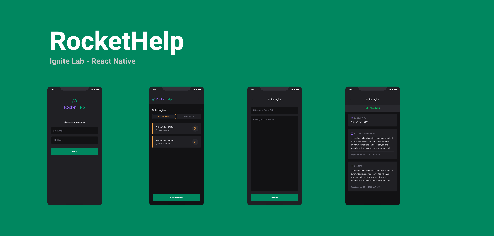
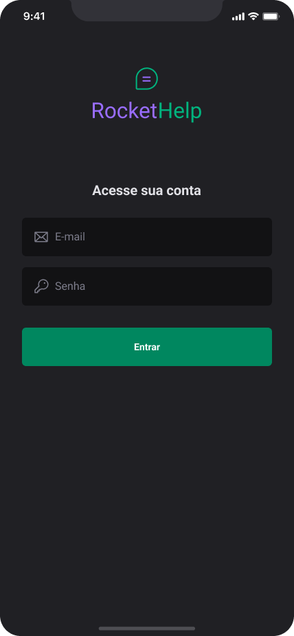
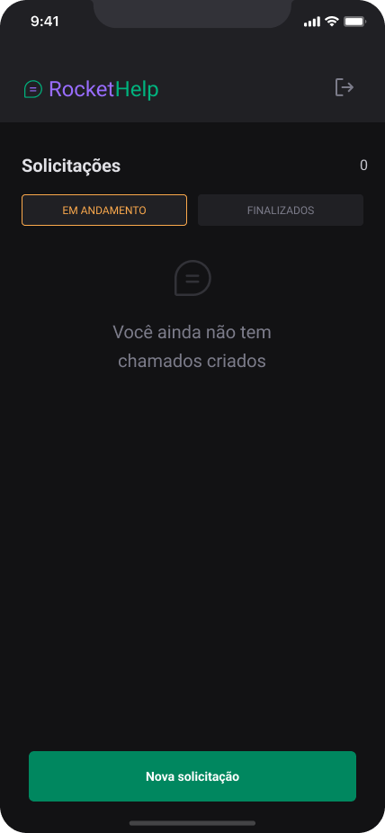
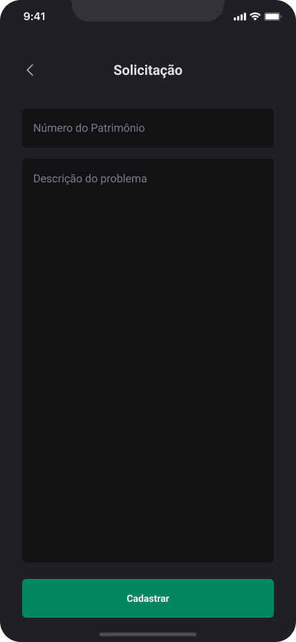
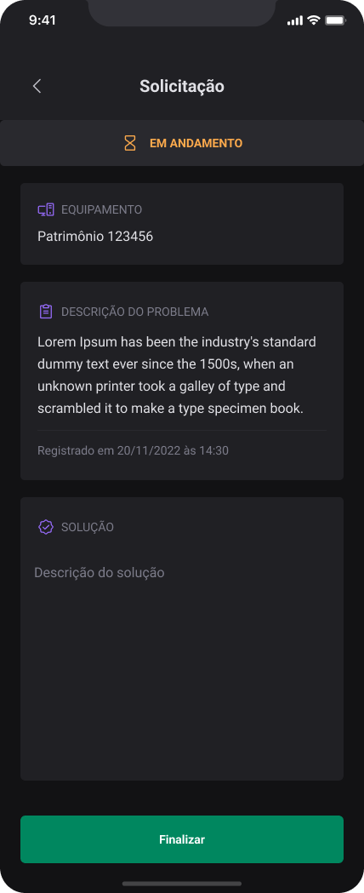
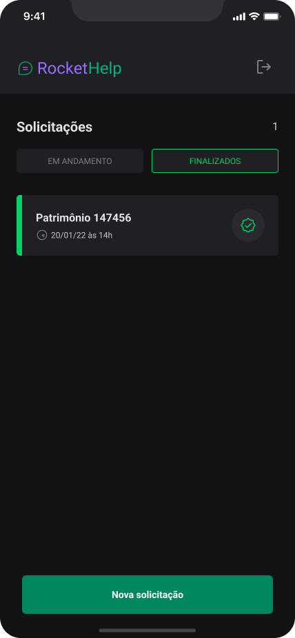
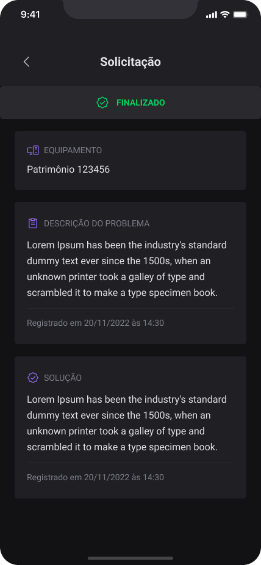

<div align="center" id="top">
  
</div>
<h1 align="start">Rocket Help - Ignite Lab - React Native</h1>
<p align="center">
  

  

  

</p>
<p align="center">
  <a href="#apple-sobre">Sobre</a> &#xa0; | &#xa0;
  <a href="#-telas-das-aplica%C3%A7%C3%A3o">Telas</a> &#xa0; | &#xa0;
  <a href="#-funcionalidades">Funcionalidades</a> &#xa0; | &#xa0;
  <a href="#rocket-tecnologias">Tecnologias</a> &#xa0; | &#xa0;
  <a href="#checkered_flag-iniciando-o-projeto-em-seu-computador">Inciando o projeto</a> &#xa0; | &#xa0;
  <a href="#-autor">Autor</a>
</p>
<br>

## :apple: Sobre ##

Projeto foi desenvolvido durante as aulas de Ignite Lab 03 da Rocketseat, o qual é um aplicação de solicitações de manutenção dos equipamentos internos de uma empresa.

# Descrição do projeto

 O aplicativo dessa edição foi uma aplicação de solicitações de manutenção de equipamentos internos de uma empresa utilizando React Native e o Firebase, registrando-as no banco e indicando o status de cada, se estavam em andamento e precisavam de solução ou se já foram finalizadas.

<br>

## 🔍 Telas da aplicação ##


  
  
  
  
  



## 🔥 Funcionalidades ##

- [x] Acesso autenticado
- [x] Cadastro de solicitações por usuário
- [x] Listagem de solicitações em aberto
- [x] Listagem de solicitações finalizadas
- [x] Finalizar solicitação

_Confira abaixo as tecnologias utilizadas no projeto:_

- [Expo](https://expo.io/)
- [Node.js](https://nodejs.org/en/)
- [React Native](https://reactnative.dev/)
- [TypeScript](https://www.typescriptlang.org/)
- [Firebase](https://www.firebase.google.com/)
- [NativeBase](https://nativebase.io/)
- [Phosphor](https://phosphoricons.com/)
## :checkered_flag: Para inicializar o projeto no seu computador ##

```bash
# Clone this project
$ git clone https://github.com/stenioEll/RocketHelp.git

# Access
$ cd Rockethelp

# Install dependencies
$ yarn

# Ou npm install

# Run the project
$ yarn android

# ou npm run android
```

## :monkey: Configurando o acesso ao banco de dados ##

### Criando um banco de dados

- Acesse o console do [firebase](https://console.firebase.google.com/)
- Selecione a opção **Adicionar projeto**
- Informe o nome para o projeto
- Clique em continuar, em seguinte clique em continuar novamente

### Criando acesso iOS para o banco de dados

- Com o projeto criado e selecionado, clique em **Visão geral do projeto**
- Agora clique em **+Adicionar app** para registrar um novo app para acesso ao seu banco de dados
- Escolha **iOS+**, preencha ID do pacote Apple e apelido
- Em seguida clique em **Registrar app**
- Na tela seguinte, faça o download do pacote **GoogleService-Info.plist**
- Clique em **Próxima**, em **Próxima** e em **Próxima** novamente e por fim em "Continuar no console**
  
### Criando acesso Android para o banco de dados

- Com o projeto criado e selecionado, clique em **Visão geral do projeto**
-
- Informe o Nome do pacote do Android
- Informe um apelido para o app
- Clique em **Registrar app**
- Na tela seguinte, faça o download do pacote **google-services.json**
- Clique em **Próxima**, em **Próxima** e em **Próxima** novamente e por fim em **Continuar no console**

🦇 **NOTA**: Estes dois arquivos devem ser salvos na raiz do projeto.

## ⏰ Configurações do arquivo app.json ##

```json
{
  "expo": {
    "name": "rockethelp",
    "slug": "rockethelp",
    "version": "1.0.0",
    "assetBundlePatterns": [
      "**/*"
    ],
    "plugins": [
      "@react-native-firebase/app"
    ],
    "android": {
      "package": "com.seunome.rockethelp",
      "googleServicesFile": "./google-services.json"
    },
    "ios": {
      "bundleIdentifier": "com.seunome.rockethelp",
      "googleServicesFile": "./GoogleService-Info.plist"
    }
  }
}
```

## 🔺 Apenas para informação ##

```bash
expo prebuild
```

**_Nota_**: Este comando faz a configuração automática do projeto Android e iOS pra você não ter que adicionar as configurações de forma manual os arquivos fora do seu código de desenvolvimento.

## Estrutura das informações no banco ##

```json
Object {
    "description": "Descrição do problema",
    "id": "jbfwxhXoJMgpKsNI7jj8",
    "patrimony": "147456",
    "status": "closed",
    "when": "20/01/22 às 18:52:38",
  },

```
## 👽 Autor ##

Feito com :heart: por <p>Stênio Ellison</p>

&#xa0;

<a href="#top">Back to top</a>


